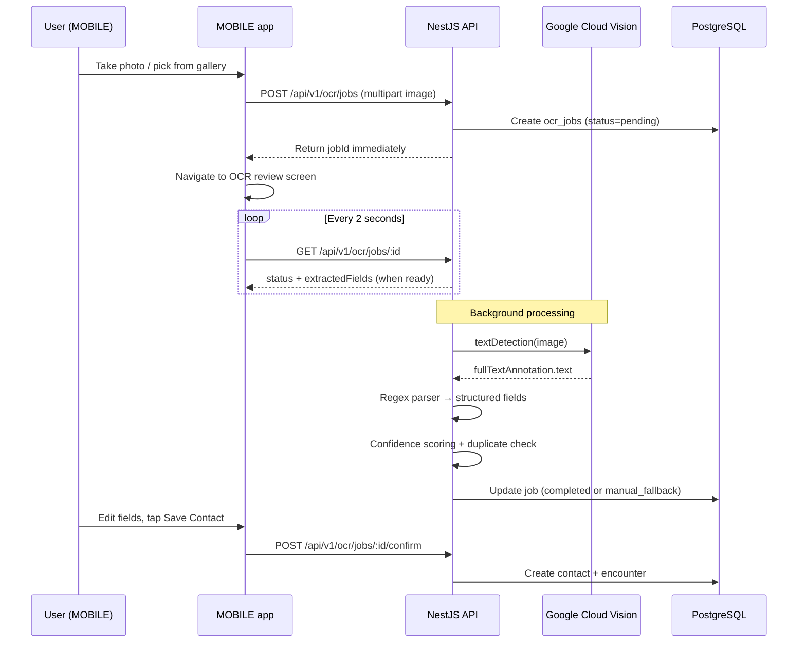

# Card Scanning & OCR — How It Works

This document explains **how CardVault scans business cards and extracts contact data** across **MOBILE**, **API**, **WEB**, and the OCR provider.

**Related docs:**
- [OCR_GOOGLE_VISION.md](./OCR_GOOGLE_VISION.md) — Google Vision setup, credentials, troubleshooting
- [OCR_EXTRACTION_PIPELINE.md](./OCR_EXTRACTION_PIPELINE.md) — full pipeline detail
- [OCR_PADDLE_LOCAL.md](./OCR_PADDLE_LOCAL.md) — legacy PaddleOCR rollback

---

## Overview

CardVault uses a **two-stage extraction pipeline**:

| Stage | Where | What it does |
|-------|-------|--------------|
| **1. Raw text OCR** | Google Cloud Vision (default) | Reads text from the card image via `textDetection` |
| **2. Structured fields** | NestJS API (`API/`) | Parses raw text into name, company, title, email, phone, website |

There is **no on-device OCR** in the mobile app. The phone captures a photo and uploads it; all text recognition runs server-side.

```
┌──────────────┐   POST /ocr/jobs    ┌─────────────┐   textDetection   ┌──────────────────┐
│ MOBILE app   │ ──────────────────► │ NestJS API  │ ────────────────► │ Google Cloud     │
│ (Expo)       │ ◄── poll + confirm  │ (port 8000) │ ◄── rawText       │ Vision API       │
└──────────────┘                     └─────────────┘                   └──────────────────┘
       │                                    │
       │                                    ▼
       │                             Regex parser → contact fields
       └──────── review & save ────────────┘
```

**WEB** does not capture cards. It is an admin console that lists saved contacts after mobile confirmation.

---

## End-to-end flow



---

## MOBILE — capture and upload

| Entry point | File |
|-------------|------|
| Home FAB | `MOBILE/app/(tabs)/home.tsx` |
| Scan tab | `MOBILE/app/(tabs)/scan.tsx` |
| Quick Capture | `MOBILE/app/(tabs)/home.tsx` |

**Upload:** `POST /api/v1/ocr/jobs` via `MOBILE/lib/submit-ocr-upload.ts`

**Review:** `MOBILE/app/ocr-review.tsx` — poll, edit, confirm

---

## API — orchestration

| File | Role |
|------|------|
| `providers/google-vision.provider.ts` | Google Cloud Vision client |
| `providers/ocr-provider.factory.ts` | `OCR_PROVIDER` selection |
| `ocr-extraction.service.ts` | Vision → regex → confidence |
| `parsers/regex.parser.ts` | Raw text → contact fields |
| `ocr-processor.service.ts` | Async job runner |

Default: `OCR_PROVIDER=google`

---

## How data is extracted

### Step 1 — Google Vision: raw text

- Input: image bytes
- API: `client.textDetection({ image: { content: buffer } })`
- Output: `fullTextAnnotation.text`

### Step 2 — API: structured fields

`RegexContactParser` extracts emails, phones, website (regex) and name/company/title (line heuristics).

**Contract (`ExtractedFieldSet`):** `fullName`, `company`, `title`, `emails[]`, `phones[]`, `website`

Confidence scoring and duplicate detection are **unchanged** from the previous pipeline.

---

## Environment

```env
OCR_PROVIDER=google
GOOGLE_VISION_KEY_PATH=./src/secure/cardvault-ocr-4a8c0f17725e.json
GOOGLE_VISION_TIMEOUT_MS=60000
```

---

## Testing

```powershell
cd API
npm run test:google-ocr -- path/to/card.jpg
npm run test:ocr -- path/to/card.jpg
```

---

## Quick file reference

| Layer | File |
|-------|------|
| API | `providers/google-vision.provider.ts` |
| API | `ocr-extraction.service.ts` |
| API | `parsers/regex.parser.ts` |
| MOBILE | `lib/submit-ocr-upload.ts` |
| MOBILE | `app/ocr-review.tsx` |
