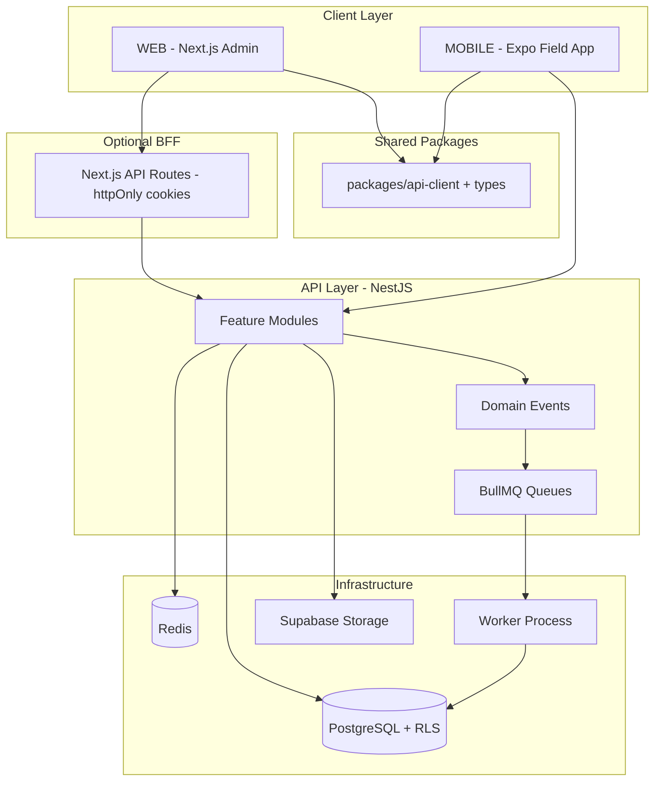

# CardVault — Comprehensive Code Review Report

**Review date:** June 13, 2026  
**Reviewer role:** Software Architect & Senior Code Reviewer  
**Scope:** Full monorepo — `API/`, `WEB/`, `MOBILE/`, `DOCS/`, root config  
**Method:** Static analysis of ~293 source files; no runtime changes made  
**Rating scale:** 1 = poor · 5 = average · 10 = exemplary

---

## Executive Summary

CardVault is a **well-architected multi-tenant SaaS MVP** with a NestJS API, Next.js admin console, and Expo mobile field app. The backend demonstrates mature patterns (tenant isolation, JWT rotation, queue-based OCR/exports), and the frontends follow modern React conventions (React Query, Zustand, typed API clients).

The project is **strong for local development and demo use** but **not production-ready** without addressing migration drift, zero automated test coverage, duplicated client code across WEB/MOBILE, missing CI/CD, and several security/operational gaps. The terminal error (`users.expo_push_token` column missing) is a concrete example of **schema drift** between Prisma schema and deployed databases.

| Layer | Verdict |
|-------|---------|
| **API** | Best-in-repo; architecture is solid, ops gaps remain |
| **WEB** | Clean admin SPA; security and DRY issues |
| **MOBILE** | Functional MVP; large screens, no release pipeline |
| **Monorepo** | Clear intent; no shared packages or CI |

**Overall composite score: 5.8 / 10** — good foundations, pre-production maturity.

---

## Rating Summary

| # | Parameter | Score | Notes |
|---|-----------|-------|-------|
| 1 | Code Quality | **6.5 / 10** | Consistent patterns; dead code, `any` usage, large inline screens |
| 2 | Code Structure | **7.5 / 10** | Clear module/route separation across all three apps |
| 3 | Code Reusability | **4.5 / 10** | Heavy duplication between WEB and MOBILE (~400+ LOC) |
| 4 | Code Optimization | **5.5 / 10** | N+1 queries, no response caching, CSR-only WEB |
| 5 | Code Performance | **6.0 / 10** | Queues and pagination good; search and OCR list need work |
| 6 | Code Standards | **6.5 / 10** | ESLint + Prettier + strict TS; inconsistent enforcement |
| 7 | PSR-12 Standards | **N/A** | PHP standard — see §7 for TypeScript equivalent |
| 8 | Production Ready | **4.0 / 10** | Migration drift, no CI, no tests, security gaps |
| 9 | **Security** *(added)* | **5.5 / 10** | Strong tenant/auth; token storage and headers weak |
| 10 | **Testing & QA** *(added)* | **1.5 / 10** | No working test suite across the monorepo |
| 11 | **Documentation** *(added)* | **7.0 / 10** | Excellent OCR/backend docs; MOBILE deploy gaps |
| 12 | **Maintainability** *(added)* | **5.5 / 10** | Triple auth storage, manual type sync |
| 13 | **Scalability** *(added)* | **6.0 / 10** | Redis/BullMQ ready; in-memory fallbacks unsafe at scale |
| 14 | **DevOps / CI-CD** *(added)* | **1.0 / 10** | No GitHub Actions, no EAS, no Docker for dev |
| 15 | **Cross-App Consistency** *(added)* | **4.5 / 10** | Duplicated clients, divergent auth patterns |

---

## 1. Code Quality — 6.5 / 10

### Strengths

- **API services are well-factored:** Controllers stay thin; business logic lives in services with DTO validation, mappers, and domain exceptions (`SessionClosedException`, `DuplicateContactDetectedException`).
- **Strict TypeScript** enabled in all three apps (`strict: true`).
- **Consistent API response envelope:** `{ data, meta? }` on success; `{ error: { code, message, correlationId } }` on failure via global `HttpExceptionFilter`.
- **Domain-rich implementation:** Contact merge, duplicate detection, encounter tracking, OCR confidence thresholds, and Stripe webhook signature verification show real business logic, not scaffolding.
- **MOBILE error UX:** `getApiErrorMessage()` provides actionable LAN IP guidance — above average for an MVP.

### Weaknesses

- **`@typescript-eslint/no-explicit-any: off`** in API ESLint — `PrismaService` uses untyped Proxy/extension patterns.
- **Dead / unused code:**
  - `RolePermission`, `RevokedToken`, `SyncQueue` models in Prisma schema with no application usage.
  - `MOBILE/lib/auth-storage.ts` duplicates persistence but is never imported.
  - `zod` listed in MOBILE `package.json` but unused.
  - `ListSkeleton` imported but unused in several WEB pages.
- **Large monolithic screens:** MOBILE `ocr-review.tsx` (~590 lines), `profile.tsx` (~350 lines) mix UI, state, and API calls inline.
- **Silent error swallowing:** WEB `handleDeleteUser` / `handleArchive` catch blocks ignore failures.
- **Copy-paste bugs:** MOBILE `contacts.tsx` `formatRelativeTime` labels minutes as "hour(s) ago".
- **Demo credentials hardcoded** in login screens (WEB and MOBILE) — must be env-gated before release.

### Evidence

```
API/src/modules/contacts/contacts.controller.ts  → thin controller pattern
API/src/common/exceptions/domain.exceptions.ts     → typed domain errors
MOBILE/lib/api-client.ts                           → getApiErrorMessage() helper
WEB/app/(admin)/admin/users/page.tsx               → inline modal duplication
```

---

## 2. Code Structure — 7.5 / 10

### Repository Layout

```
CardVault/
├── API/       NestJS modular monolith (14+ feature modules)
├── WEB/       Next.js 14 App Router admin console
├── MOBILE/    Expo SDK 54 field app
└── DOCS/      Product specs & engineering guides
```

### API Structure (Best in Monorepo)

| Layer | Location | Purpose |
|-------|----------|---------|
| Modules | `src/modules/*` | Feature domains (auth, contacts, ocr, sessions, billing…) |
| Cross-cutting | `src/common/*` | Guards, filters, interceptors, decorators, DTOs |
| Infrastructure | `src/prisma`, `src/redis`, `src/queue`, `src/storage` | Data, cache, jobs, files |
| Config | `src/config/*` | Database URL, JWT keys, upload limits |
| Contracts | `src/contracts/*` | Shared constants and minimal types |
| Worker | `worker.main.ts`, `worker.module.ts` | Separate BullMQ consumer process |

NestJS module → controller → service → DTO + mapper is applied consistently.

### WEB Structure

- Route groups: `(admin)` and `(auth)` — clean URL separation.
- Component tiers: `ui/` (primitives), `admin/` (domain), `layout/`, `shared/`.
- Data layer: `lib/api-client.ts` + `hooks/*.ts` + Zustand stores.
- Middleware handles auth redirects and role-based route guards.

### MOBILE Structure

- Expo Router file-based routing with tab + stack flows.
- Lean `components/` (3 files); most logic in `app/` screens and `lib/`.
- Zustand for auth, session capture context, and theme.

### Weaknesses

- **No monorepo tooling** (npm workspaces, Turborepo, Nx) — three independent `package.json` files with no shared packages.
- **WEB uses App Router as SPA shell** — almost every page is `'use client'`; Next.js RSC benefits unused.
- **Contracts folder is a stub** — `API/src/contracts/types.ts` documents sync with WEB only; MOBILE omitted.

---

## 3. Code Reusability — 4.5 / 10

### What Works

- **API internal reuse:** Shared pagination utilities (`resolvePagination`, `toPaginatedResult`), audit service, tenant guards, OCR provider factory.
- **WEB admin primitives:** `DataTable<T>`, `PaginationBar`, `PageHeader`, `EmptyState`, `BarChart` reused across 6+ pages.
- **OCR pipeline abstraction:** Strategy + Factory pattern for Google Vision vs PaddleOCR providers.

### Major Duplication (Cross-App)

| Module | MOBILE | WEB | Est. duplicated LOC |
|--------|--------|-----|---------------------|
| `lib/api-client.ts` | ~500 lines | ~560 lines | ~400+ |
| `lib/types.ts` | ~155 lines | ~250 lines | ~150 |
| `lib/format.ts`, `roles.ts`, `constants.ts` | Present | Present | ~80 |
| Auth persistence | AsyncStorage pattern | localStorage + cookies | ~60 |

Paginated response mapping is repeated ~8 times inside WEB `api-client.ts` alone — a single `toPaginatedList()` helper would eliminate this.

### Bypass Patterns

- `useCreateOrgUser` (WEB) calls `api.post('/users')` directly instead of `api-client` factory.
- `contacts/[id]/page.tsx` calls `mergeContacts()` directly instead of `useMergeContacts` hook.
- MOBILE `profile.tsx` calls `api.get('/auth/me')` instead of `fetchMe(api)`.

**Recommendation:** Extract `packages/shared-api-client` and `packages/shared-types` as npm workspace packages consumed by WEB and MOBILE.

---

## 4. Code Optimization — 5.5 / 10

### Strengths

- **Background job offloading:** BullMQ queues for OCR, exports, relationship matching when Redis is configured.
- **Pagination everywhere:** List endpoints use shared pagination helpers — no unbounded queries.
- **React Query caching:** WEB and MOBILE use `staleTime` defaults (30s) and smart polling for export jobs.
- **Idempotency keys** on OCR submit and encounter creation prevent duplicate writes.

### Weaknesses

| Issue | Location | Impact |
|-------|----------|--------|
| **N+1 queries in OCR list** | `ocr.service.ts` — `enrichJob()` runs 2 extra DB queries per row | Slow list at scale |
| **Unindexed full-text search** | `contacts.service.ts` — runtime `to_tsvector()` | Table scans on large contact sets |
| **Memory storage for OCR uploads** | `ocr.controller.ts` — `memoryStorage()` | Memory pressure under concurrency |
| **No API response caching** | Redis used only for rate limits + token blocklist | Repeated identical reads |
| **100% CSR on WEB** | All admin pages client-rendered | Slower first paint |
| **Google Fonts via CSS `@import`** | `WEB/styles/globals.css` | Render-blocking |
| **No table virtualization** | WEB `DataTable` | Fine at 20 rows/page; won't scale |

---

## 5. Code Performance — 6.0 / 10

### Architecture Decisions (Good)

- Separate **API worker process** (`npm run start:worker`) for BullMQ consumers — API stays responsive.
- **PostgreSQL RLS + Prisma tenant extension** — defense-in-depth without application-level query rewriting on every call.
- **Trigram index** (`pg_trgm`) on contact name/company for fuzzy search fallback.
- **Correlation IDs** on every request — aids production debugging without performance cost.

### Concerns

- **In-process job fallback** when `REDIS_URL` unset — acceptable for local dev, not for multi-instance production.
- **In-memory rate limiting and token blocklist** without Redis — breaks across horizontally scaled API pods.
- **Platform admin cross-tenant queries** conflict with Prisma tenant extension (overwrites `organizationId` filter) — functional bug that may cause extra failed queries/retries.
- **Framer Motion** on WEB login and mobile drawer adds JS bundle weight.
- **No CDN / image optimization strategy** documented for card images beyond signed URL generation.

---

## 6. Code Standards — 6.5 / 10

### Tooling Matrix

| App | ESLint | Prettier | TypeScript Strict | Format Script | Pre-commit |
|-----|--------|----------|-------------------|---------------|------------|
| API | ✅ Custom + Prettier plugin | ✅ | ✅ | ❌ | ❌ |
| WEB | ✅ next/core-web-vitals only | ❌ | ✅ | ❌ | ❌ |
| MOBILE | ❌ | ❌ | ✅ | ❌ | ❌ |

### Conventions Observed

- **Naming:** camelCase TS, snake_case DB columns via Prisma `@map`, kebab-case file names in NestJS modules.
- **DTO validation:** `class-validator` decorators with global `ValidationPipe` (`whitelist`, `forbidNonWhitelisted`, `transform`).
- **API versioning:** `/api/v1` prefix consistently applied.
- **Soft deletes:** `deletedAt` pattern used across tenant models.
- **Audit trail:** `AuditService` called on sensitive operations.

### Gaps

- No shared ESLint config across monorepo.
- No Prettier in WEB/MOBILE.
- No import ordering rules.
- No Husky / lint-staged.
- MOBILE has zero lint enforcement.
- WEB `tailwind.config.ts` references non-existent `./features/**` path.
- Inconsistent Tailwind tokens: `text-muted` used but not defined (should be `text-text-tertiary`).

---

## 7. PSR-12 Standards — Not Applicable (TypeScript Equivalent: 6.0 / 10)

> **PSR-12** is a PHP coding standard (PHP-FIG). CardVault is a **TypeScript / Node.js** monorepo. PSR-12 does not apply.

### Equivalent Evaluation (TypeScript / NestJS / React Conventions)

| PSR-12 Principle | CardVault Equivalent | Compliance |
|------------------|------------------------|------------|
| File structure & namespaces | NestJS modules, ES modules | ✅ Good |
| Indentation & line length | Prettier (API only) | ⚠️ Partial |
| Naming conventions | Consistent across API; looser in MOBILE screens | ⚠️ Partial |
| Visibility & type declarations | TypeScript strict mode | ✅ Good |
| Control structure formatting | Prettier-enforced in API | ⚠️ WEB/MOBILE unformatted |
| Documentation blocks | Minimal JSDoc; engineering MD docs instead | ⚠️ Partial |

**Equivalent score: 6.0 / 10** — API meets most TypeScript/NestJS community standards; WEB and MOBILE lack formatting enforcement.

---

## 8. Production Ready — 4.0 / 10

### Ready ✅

| Area | Status |
|------|--------|
| Health endpoint | DB + Redis ping at `/api/v1/health` |
| Structured error responses | Correlation ID in every error |
| JWT auth with refresh rotation | Replay-attack detection |
| Multi-tenant isolation | Guards + Prisma extension + PostgreSQL RLS |
| Background workers | BullMQ OCR/export processors |
| Stripe webhooks | Raw body + signature verification |
| Optional Sentry | Loaded via `instrument.ts` |
| Environment examples | `.env.example` in all three apps |
| Database migrations | 7 versioned SQL migrations in `prisma/migrations/` |
| Seed data | Demo orgs and users for QA |

### Blockers ❌

| Blocker | Severity | Detail |
|---------|----------|--------|
| **Migration drift** | 🔴 Critical | README recommends `db:push`; production needs `db:migrate:deploy`. Missing `expo_push_token` column causes login failures (observed in terminal). |
| **Zero working tests** | 🔴 Critical | Jest declared in API but no `jest.config.js`; e2e tests are stale boilerplate. WEB/MOBILE have no tests. |
| **No CI/CD** | 🔴 Critical | No `.github/workflows`, no automated lint/typecheck/test/migrate pipeline. |
| **Token storage (WEB)** | 🔴 High | Access/refresh tokens in `localStorage` + non-httpOnly cookies — XSS can steal credentials. |
| **Redis required for prod** | 🟠 High | In-memory fallbacks for rate limits, token blocklist, and job queue unsafe with multiple API instances. |
| **No security headers** | 🟠 High | No `helmet`, no CSP, empty `next.config.mjs`. |
| **MOBILE release pipeline** | 🟠 High | No `eas.json`, missing `assets/icon.png`, `usesCleartextTraffic: true` for Android. |
| **Platform admin bug** | 🟠 High | Prisma tenant extension overwrites cross-tenant queries for `platform_super_admin`. |
| **No API documentation** | 🟡 Medium | No Swagger/OpenAPI spec generated. |
| **No monitoring** | 🟡 Medium | Optional Sentry only; no structured JSON logging or metrics. |
| **Demo creds in UI** | 🟡 Medium | Hardcoded in production builds. |

### Immediate Fix for Observed Error

The terminal shows:

```
The column `users.expo_push_token` does not exist in the current database.
```

**Root cause:** Prisma schema includes `expoPushToken` but the database was synced via `db:push` before migration `20260605120000_add_expo_push_token` was applied.

**Fix (ops, not code):** Run `npm run db:migrate:deploy` in `API/` on all environments.

---

## 9. Additional Parameters

### 9.1 Security — 5.5 / 10

| Area | Assessment |
|------|------------|
| Tenant isolation | Strong — org filter + RLS; returns 404 not 403 (enumeration-resistant) |
| Authentication | JWT rotation, bcrypt cost 12, login rate limit (5/15min) |
| Authorization | Role-based guards; `RolePermission` model unused (hard-coded enums only) |
| File uploads | 10 MB limit; MIME type from client not verified server-side |
| CORS | Configurable; defaults to localhost:3000 |
| Stripe | Webhook signature verified |
| Push tokens | Stored plaintext; minimal format validation |
| Refresh endpoint | **Not rate-limited** (login is) |
| CSRF | N/A for pure JWT API clients; relevant if cookie-based auth added |

### 9.2 Testing & QA — 1.5 / 10

| App | Unit Tests | Integration/E2E | CI |
|-----|------------|-----------------|-----|
| API | 0 | 2 stale e2e specs | ❌ |
| WEB | 0 | 0 | ❌ |
| MOBILE | 0 | 0 | ❌ |

The API `test/tenant-isolation.e2e-spec.ts` contains meaningful tenant tests but does not mirror `main.ts` bootstrap (missing global prefix, pipes, filters).

### 9.3 Documentation — 7.0 / 10

**Strong:** Root README, `LOCAL_DEV.md`, `CARD_SCANNING.md`, OCR guides, `REPO_SCOPE.md`, `SAAS_GAP_AUDIT_TRD.md`, design system recommendations.

**Gaps:** No MOBILE architecture doc, `DEPLOY_ENV.md` ignores Expo/EAS, `DOCS/README.md` references missing `product/` folder, contract sync docs omit MOBILE.

### 9.4 Maintainability — 5.5 / 10

- **Triple auth storage in WEB:** localStorage + Zustand persist + document.cookie — easy to desync.
- **Manual type sync:** API contracts ↔ WEB types ↔ MOBILE types — no codegen or shared package.
- **README vs code drift:** Port defaults (4000 in code vs 8000 in docs), audit doc claims MOBILE has no stores (stores now exist).

### 9.5 Scalability — 6.0 / 10

Architecture supports horizontal scaling (stateless API + Redis + worker), but in-memory fallbacks and N+1 queries will bottleneck before infrastructure limits are reached.

### 9.6 DevOps / CI-CD — 1.0 / 10

No GitHub Actions, no EAS Build config, no Docker Compose, no pre-commit hooks, no automated migration checks.

### 9.7 Cross-App Consistency — 4.5 / 10

Same domain types and API client duplicated three times. Auth patterns differ (WEB cookies + Zustand vs MOBILE AsyncStorage). Correlation ID generation differs (UUID vs timestamp).

---

## 10. Design Pattern Analysis & Recommendations

### Patterns Already in Use (Keep & Extend)

| Pattern | Where Used | Assessment |
|---------|------------|------------|
| **Modular Monolith (DDD-lite)** | NestJS feature modules | ✅ Correct for current scale |
| **Repository-like access** | Prisma services per module | ✅ Adequate; direct Prisma is fine at this size |
| **Strategy + Factory** | OCR providers (`google`, `paddle`) | ✅ Well implemented |
| **Adapter** | Storage service (local filesystem vs Supabase) | ✅ Good abstraction |
| **Decorator** | NestJS `@Public()`, `@Roles()`, `@RateLimit()` | ✅ Clean cross-cutting |
| **Interceptor / Middleware** | Tenant context, correlation ID, request logging | ✅ Production-grade |
| **CQRS-lite** | Separate read paths for analytics/dashboard | ⚠️ Implicit, not formalized |

### Recommended Patterns (Priority Order)

#### 1. Monorepo Shared Kernel (Highest Impact)

```
packages/
├── api-client/     createApiClient + all fetchXxx functions
├── types/          Domain types generated from OpenAPI or Prisma
├── constants/      STORAGE_KEYS, API_BASE_PATH, roles
└── utils/          format helpers, error parsers
```

**Why:** Eliminates ~500+ LOC duplication, single source of truth for API contract changes, reduces drift risk between WEB and MOBILE.

**Pattern name:** Shared Kernel (DDD) + npm Workspaces

---

#### 2. Backend-for-Frontend (BFF) for WEB Auth

Move token issuance to httpOnly secure cookies set by a thin Next.js API route or dedicated BFF layer. Middleware continues to gate routes; JavaScript never reads raw tokens.

**Why:** Fixes the highest-severity WEB security gap without changing mobile JWT flow.

**Pattern name:** BFF (Backend for Frontend)

---

#### 3. Event-Driven Notifications

Replace direct Expo push calls inside `NotificationsService.create()` with domain events:

```
ContactCreated → NotificationHandler → Queue → PushWorker
OcrCompleted   → NotificationHandler → Queue → PushWorker
```

**Why:** Decouples notification delivery from business transactions; enables retry, dead-letter, and future channels (email, SMS).

**Pattern name:** Domain Events + Outbox (or BullMQ job per event)

---

#### 4. Specification Pattern for Complex Queries

Extract contact search, duplicate detection, and analytics filters into composable `Specification` objects instead of inline Prisma `where` builders.

**Why:** Contact merge/search logic is growing; specifications improve testability and reuse across services.

**Pattern name:** Specification Pattern

---

#### 5. Tenant Context Strategy (Fix Platform Admin)

Implement explicit tenant bypass for platform roles using the existing but unused `bypassTenantScope` flag in `TenantContextInterceptor`, or a dedicated `PlatformAdminService` that uses `$queryRaw` / Prisma `$extends` override.

**Why:** Fixes cross-tenant admin queries without weakening default tenant isolation.

**Pattern name:** Strategy Pattern for tenant scoping modes (`StrictTenant` | `PlatformBypass`)

---

#### 6. OpenAPI-First Contract

Generate `openapi.json` from NestJS decorators (Swagger module), then codegen TypeScript clients for WEB and MOBILE.

**Why:** Replaces manual "keep in sync" comments in `API/src/contracts/types.ts`.

**Pattern name:** Contract-First API Design

---

#### 7. Unit of Work (Formalize Existing Usage)

Prisma `$transaction` is already used for contact merges. Formalize a `UnitOfWork` wrapper for multi-step operations (OCR confirm → contact create → encounter link → audit log).

**Why:** Ensures atomicity and gives a single place to emit domain events post-commit.

**Pattern name:** Unit of Work

---

### Recommended Architecture (Target State)



---

## 11. Prioritized Action Plan

### P0 — Production Blockers

1. Run `db:migrate:deploy` on all environments; align README to migrations over `db:push`.
2. Add Jest config; fix e2e bootstrap; add CI pipeline (lint + typecheck + test).
3. Fix platform-admin tenant bypass in Prisma extension.
4. Require `REDIS_URL` in production; run worker as separate process.

### P1 — Security & Quality

5. Implement httpOnly cookie auth for WEB (BFF pattern).
6. Add `helmet`, security headers in `next.config.mjs`.
7. Extract shared `packages/api-client` monorepo package.
8. Add ESLint + Prettier to WEB and MOBILE.

### P2 — Performance & Maintainability

9. Fix OCR list N+1 with Prisma `include`.
10. Add persisted/generated tsvector column for contact search.
11. Extract shared WEB hooks: `useDebouncedValue`, `parseApiError`, `Modal`, `Select`.
12. Add `error.tsx` / `loading.tsx` to WEB admin layout.

### P3 — Mobile Release

13. Add EAS config, app assets, push notification deep linking.
14. Remove demo credentials from production builds.
15. Create `DOCS/engineering/MOBILE.md` and update `DEPLOY_ENV.md`.

---

## 12. Score by Application Layer

| Layer | Quality | Structure | Reusability | Optimization | Performance | Standards | Production |
|-------|---------|-----------|-------------|--------------|-------------|-----------|------------|
| **API** | 7.5 | 8.5 | 7.0 | 6.0 | 6.5 | 7.5 | 5.0 |
| **WEB** | 6.5 | 7.5 | 5.0 | 5.0 | 5.0 | 6.0 | 4.5 |
| **MOBILE** | 6.0 | 7.0 | 4.0 | 5.5 | 6.0 | 4.5 | 3.5 |
| **DOCS** | 7.0 | 7.5 | N/A | N/A | N/A | 7.0 | 6.0 |

---

## 13. Conclusion

CardVault demonstrates **above-average architecture for a freelance MVP**: the NestJS backend is the strongest component, with genuine multi-tenant SaaS patterns that many production apps lack. The WEB admin console is well-organized but reads as a pre-production SPA with security and duplication debt. The MOBILE app delivers a complete field-sales loop but needs a release pipeline and shared client extraction.

The single highest-leverage improvement is **introducing a shared monorepo package for API client + types**, followed by **CI/CD + working tests** and **migration discipline**. Design-pattern-wise, extend the existing Modular Monolith + Strategy/Factory patterns with a **Shared Kernel package**, **BFF for WEB auth**, and **Domain Events for notifications** — these align with the current codebase without requiring a rewrite.

---

*Report generated from static analysis. No source code was modified during this review.*
