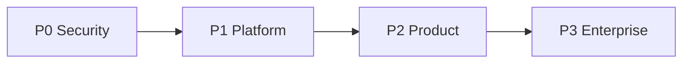

# CardVault — Step-by-Step SaaS Gap Implementation Plan

**Companion to:** [SAAS_GAP_AUDIT_TRD.md](./SAAS_GAP_AUDIT_TRD.md)  
**TRD reference:** `DOCS/_extracted/CardVault_TRD.txt` v3.0  
**Last updated:** May 2026

Use this document as the **execution checklist**. Mark steps `[x]` as you complete them. Do not skip **P0** before onboarding a second production customer.

---

## How to use this plan

| Symbol | Meaning |
|--------|---------|
| **Step** | Single commit-sized unit of work |
| **Blocked by** | Must finish first |
| **Delivers** | What “done” looks like |
| **Files** | Primary touch points |

**Suggested order:** P0 → P1 → P2 → P3. Within a phase, follow step numbers.

---

## Phase 0 — Prerequisites (before P0)

| Step | Action | Files / commands | Delivers |
|------|--------|------------------|----------|
| 0.1 | Create Supabase projects: `dev`, `staging`, `prod` | Supabase dashboard | Managed PG + Auth + Storage per env |
| 0.2 | Provision Upstash Redis per env | Upstash dashboard | Redis URL for rate limit + queues |
| 0.3 | Replace `db:push` with versioned migrations | `API/prisma/migrations/` | Reproducible schema in all envs |
| 0.4 | Document env matrix | `API/.env.example`, `DOCS/engineering/DEPLOY_ENV.md` (new) | One place for all secrets |
| 0.5 | Add second seed org (`acme-demo`) | `API/prisma/seed.ts` | Manual cross-tenant test data |

**Acceptance:** Two orgs in DB; API runs against Supabase dev URL; health shows `database: up`.

---

## P0 — Security & tenancy (before multi-customer production)

> **Goal:** No tenant can read another tenant’s data even if application code regresses.

### P0.1 — Request-scoped tenant context

| | |
|--|--|
| **TRD** | §3.2 TenantContextMiddleware; §7.3 |
| **Blocked by** | 0.3 |

| Step | Action | Files |
|------|--------|-------|
| P0.1.1 | Create `TenantContext` interface (`organizationId`, `userId`, `role`) | `API/src/common/tenant/tenant-context.ts` (new) |
| P0.1.2 | Create middleware: read `request.user.organizationId` from JWT, attach `req.tenant` | `API/src/common/middleware/tenant-context.middleware.ts` (new) |
| P0.1.3 | Register middleware **after** JWT guard populates `user` (use middleware on routes or interceptor post-auth) | `API/src/app.module.ts` |
| P0.1.4 | Add `@Tenant()` param decorator wrapping `req.tenant` | `API/src/common/decorators/tenant.decorator.ts` (new) |
| P0.1.5 | Refactor one service (`contacts.service.ts`) to use `tenant.organizationId` instead of `user.organizationId` | Pattern for all modules |
| P0.1.6 | Repeat for `ocr`, `sessions`, `exports`, `users`, `dashboard`, `audit` | All `*.service.ts` with org filters |

**Acceptance:** Every authenticated handler has `req.tenant.organizationId`; grep shows no raw `user.organizationId` in services (optional lint rule).

---

### P0.2 — TenantGuard (cross-tenant URL rejection)

| | |
|--|--|
| **TRD** | §7.3 — reject org in URL vs JWT |
| **Blocked by** | P0.1 |

| Step | Action | Files |
|------|--------|-------|
| P0.2.1 | Create `TenantGuard`: if route param `organizationId` or body `organizationId` present and ≠ JWT org → `403` | `API/src/common/guards/tenant.guard.ts` (new) |
| P0.2.2 | Register as global `APP_GUARD` **after** `JwtAuthGuard` | `API/src/common/common.module.ts` or `auth.module.ts` |
| P0.2.3 | Add integration test: user A token + org B id in path → 403 | `API/test/tenant-guard.e2e-spec.ts` (new) |

**Acceptance:** `POST /contacts` with spoofed `organizationId` in body returns 403.

---

### P0.3 — Row Level Security (RLS)

| | |
|--|--|
| **TRD** | §4.4, §7.3, migration `007_create_rls_policies_v30` |
| **Blocked by** | 0.1, 0.3 |

| Step | Action | Files |
|------|--------|-------|
| P0.3.1 | Enable Supabase Auth JWT template with `org` claim OR set PG role from Nest service role + pass `org` per request | Supabase dashboard |
| P0.3.2 | Create SQL migration: `ALTER TABLE ... ENABLE ROW LEVEL SECURITY` for all tenant tables | `API/prisma/migrations/YYYYMMDD_rls_enable/migration.sql` |
| P0.3.3 | Policy template: `USING (organization_id = (auth.jwt() ->> 'org')::uuid)` for SELECT/INSERT/UPDATE/DELETE | Same migration |
| P0.3.4 | `audit_events`: SELECT for org; INSERT only; **no** UPDATE/DELETE policies | Same migration |
| P0.3.5 | Use Supabase **service role** only in workers; API uses **authenticated** role with user JWT forwarded OR set `SET LOCAL app.org_id` per transaction | `API/src/prisma/prisma.service.ts` extension |
| P0.3.6 | Document bypass: workers use service role + explicit `organizationId` in job payload | `DOCS/engineering/RLS.md` (new) |

**Acceptance:** Direct SQL as User A cannot `SELECT` contacts where `organization_id` = Org B.

---

### P0.4 — JWT hardening & revocation

| | |
|--|--|
| **TRD** | §7.1 — jti blocklist, refresh rotation, auth rate limit |
| **Blocked by** | 0.2 |

| Step | Action | Files |
|------|--------|-------|
| P0.4.1 | Add `ioredis` + `RedisModule` | `API/package.json`, `API/src/redis/redis.module.ts` (new) |
| P0.4.2 | On login/refresh: store `blocklist:{jti}` is NOT needed for new tokens; on **logout**: `SET blocklist:{jti} 1 EX ttl` | `API/src/modules/auth/auth.service.ts` |
| P0.4.3 | In `verifyAccessToken`: check Redis for `blocklist:{jti}` | `auth.service.ts` |
| P0.4.4 | Refresh rotation: persist `refresh_token_jti` on user or `user_sessions` table; invalidate previous on refresh | `schema.prisma` + `auth.service.ts` |
| P0.4.5 | Implement `logout` to revoke access `jti` + refresh `jti` | `auth.controller.ts` |
| P0.4.6 | Auth rate limit: 5 failures / 15 min / IP → 429 + `Retry-After` | `API/src/common/guards/auth-rate-limit.guard.ts` (new) on `login` |
| P0.4.7 | Health: `redis: up|down` from `PING` | `health.controller.ts` |

**Acceptance:** After logout, old access token returns 401; 6th failed login in 15 min returns 429.

**Alternative (faster):** Migrate to **Supabase Auth** — skip P0.4.1–4.4, use Supabase session + RLS `auth.uid()`.

---

### P0.5 — Audit completeness & immutability

| | |
|--|--|
| **TRD** | §7.5 |
| **Blocked by** | P0.3 |

| Step | Action | Files |
|------|--------|-------|
| P0.5.1 | Log `auth.login.success`, `auth.login.failed`, `auth.logout` to `audit_events` | `auth.service.ts`, `auth.controller.ts` |
| P0.5.2 | Pass `ipAddress`, `userAgent`, `correlationId` from request into `AuditService.log` | `audit.service.ts`, controllers |
| P0.5.3 | Log export created/completed, session created/closed, role changes | respective services |
| P0.5.4 | Log relationship match decision on OCR confirm | `ocr.service.ts` |
| P0.5.5 | DB trigger or RLS: deny UPDATE/DELETE on `audit_events` | SQL migration |

**Acceptance:** Login appears in admin audit log; manual SQL DELETE on audit row fails.

---

### P0 checklist

- [ ] P0.1 Tenant context middleware
- [ ] P0.2 TenantGuard
- [ ] P0.3 RLS policies
- [ ] P0.4 JWT revocation + auth rate limit
- [ ] P0.5 Audit auth + immutability

---

## P1 — Operable SaaS platform

> **Goal:** Stateless API, async work, shared storage, platform admin.

### P1.1 — Redis & BullMQ foundation

| | |
|--|--|
| **TRD** | §8.1, §8.2 |
| **Blocked by** | P0.4.1 (Redis module) |

| Step | Action | Files |
|------|--------|-------|
| P1.1.1 | Add `@nestjs/bullmq`, `bullmq` | `API/package.json` |
| P1.1.2 | `BullModule.forRoot({ connection: REDIS_URL })` | `API/src/queue/queue.module.ts` (new) |
| P1.1.3 | Register queues from `contracts/constants.ts` `BULL_QUEUES` | `queue.module.ts` |
| P1.1.4 | Create `worker.ts` entry (separate process): `nest start worker` or `node dist/worker` | `API/src/worker.main.ts` (new) |
| P1.1.5 | Add npm script `start:worker` | `API/package.json` |

**Acceptance:** Worker process starts; Bull Board or Redis CLI shows empty queues.

---

### P1.2 — Move OCR to `ocr-processing` queue

| | |
|--|--|
| **TRD** | §8.1 `ocr-processing` |
| **Blocked by** | P1.1 |

| Step | Action | Files |
|------|--------|-------|
| P1.2.1 | Create `OcrProcessingProcessor` implementing Bull worker | `API/src/modules/ocr/processors/ocr-processing.processor.ts` (new) |
| P1.2.2 | Replace `processor.schedule()` `setImmediate` with `ocrQueue.add('process', { jobId, filePath })` | `ocr.service.ts`, remove in-process from `ocr-processor.service.ts` |
| P1.2.3 | Retry: 3 attempts, exponential backoff | Queue job options |
| P1.2.4 | On failure: set `ocr_jobs.status = failed`, `error_message` | processor |
| P1.2.5 | API `submit` only enqueues; returns job id immediately | `ocr.service.ts` |

**Acceptance:** Kill API mid-OCR — worker still completes job; API restart does not lose jobs.

---

### P1.3 — Move export to `export-generation` queue

| Step | Action | Files |
|------|--------|-------|
| P1.3.1 | `ExportGenerationProcessor` | `exports/processors/export-generation.processor.ts` (new) |
| P1.3.2 | Replace `export-processor.service.ts` `setImmediate` | `exports.service.ts` |
| P1.3.3 | Signed URL written on completion (see P1.4) | processor |

**Acceptance:** Large export does not block HTTP thread.

---

### P1.4 — Relationship & dedup queues

| Step | Action | Files |
|------|--------|-------|
| P1.4.1 | After OCR completes, enqueue `relationship-matching` job | `ocr-processing.processor.ts` |
| P1.4.2 | Move `duplicate-detection` logic to `DeduplicationProcessor` (optional split) | `duplicate-detection.service.ts` |
| P1.4.3 | `session-counter-sync` job: batch Redis counters → PG every 5s | `sessions/session-counter.service.ts` (new) |

**Acceptance:** OCR job completion triggers relationship match asynchronously.

---

### P1.5 — Supabase Storage + signed URLs

| | |
|--|--|
| **TRD** | §1.1, §7.4 |
| **Blocked by** | 0.1 |

| Step | Action | Files |
|------|--------|-------|
| P1.5.1 | Add `@supabase/supabase-js` | `API/package.json` |
| P1.5.2 | `StorageService`: upload buffer, path `org/{orgId}/sessions/{sessionId}/{contactId}/{file}` | `API/src/storage/storage.service.ts` (new) |
| P1.5.3 | Replace `writeFile` in OCR submit with storage upload | `ocr.service.ts` |
| P1.5.4 | `GET /images/:id/url` → signed URL 1h TTL | `API/src/modules/images/images.controller.ts` (new module) |
| P1.5.5 | `POST /images/upload-url` presigned PUT (optional two-step upload) | `images.service.ts` |
| P1.5.6 | Bucket policy: path prefix = caller org only | Supabase dashboard |
| P1.5.7 | Remove or gate local `upload.ts` behind `STORAGE_DRIVER=local` for dev | `config/upload.ts` |

**Acceptance:** Card image accessible only via signed URL; URL expires after 1 hour.

---

### P1.6 — API rate limiting

| | |
|--|--|
| **TRD** | §5.1 |

| Step | Action | Files |
|------|--------|-------|
| P1.6.1 | Global: 1000 req / 15 min / user (or IP if anonymous) | `API/src/common/guards/rate-limit.guard.ts` |
| P1.6.2 | OCR upload: 30/min | `ocr.controller.ts` |
| P1.6.3 | Export: 5/hr | `exports.controller.ts` |
| P1.6.4 | Return `429` + `Retry-After` header | guard |

**Acceptance:** Burst over limit returns 429 with retry header.

---

### P1.7 — Organizations module (platform admin)

| | |
|--|--|
| **TRD** | §5.2 `/admin/organizations` |
| **Blocked by** | P0.2 |

| Step | Action | Files |
|------|--------|-------|
| P1.7.1 | `OrganizationsModule` with CRUD | `API/src/modules/organizations/*` (new) |
| P1.7.2 | `GET/POST /admin/organizations`, `GET/PATCH /admin/organizations/:id` | `organizations.controller.ts` |
| P1.7.3 | `@Roles(super_admin)` only; **no** `organizationId` filter on list | `organizations.service.ts` |
| P1.7.4 | `super_admin` dashboard stats: optional `?organizationId=` or platform aggregate | `dashboard.service.ts` |
| P1.7.5 | WEB: `/admin/organizations` page | `WEB/app/(admin)/admin/organizations/page.tsx` (new) |

**Acceptance:** `admin@cardvault.local` lists all orgs; `manager@` gets 403.

---

### P1.8 — Plan & quota enforcement (basic)

| Step | Action | Files |
|------|--------|-------|
| P1.8.1 | `OrganizationGuard` or service: check `maxUsers` before user invite | `users.service.ts` |
| P1.8.2 | Check `storageQuotaGb` before image upload | `storage.service.ts` |
| P1.8.3 | `is_active = false` → reject login with clear message | `auth.service.ts` |

**Acceptance:** Cannot exceed seeded `max_users`; deactivated org cannot log in.

---

### P1 checklist

- [ ] P1.1 BullMQ + worker process
- [ ] P1.2 OCR queue
- [ ] P1.3 Export queue
- [ ] P1.4 Relationship + session counter queues
- [ ] P1.5 Supabase Storage
- [ ] P1.6 Rate limits
- [ ] P1.7 Organizations admin
- [ ] P1.8 Quota enforcement

---

## P2 — Product completeness (TRD v3 UX & APIs)

### P2.1 — Sessions API completion

| | |
|--|--|
| **TRD** | §5.2 Sessions |

| Step | Action | Files |
|------|--------|-------|
| P2.1.1 | `PATCH /sessions/:id` — name, dates, settings | `sessions.controller.ts`, DTO |
| P2.1.2 | `POST /sessions/:id/close` — status `closed` | `sessions.service.ts` |
| P2.1.3 | `POST /sessions/:id/join` — create `session_members` row | `sessions.service.ts` |
| P2.1.4 | `POST /sessions/:id/members` — add user by id (manager) | `sessions.service.ts` |
| P2.1.5 | `GET /sessions/:id/stats` — scan + lead counts | `sessions.service.ts` |
| P2.1.6 | Reject OCR confirm if session `closed` → `SESSION_CLOSED` error code | `ocr.service.ts` |

**Acceptance:** Mobile/web can close session; new scans to closed session fail with documented code.

---

### P2.2 — Encounters API

| Step | Action | Files |
|------|--------|-------|
| P2.2.1 | `GET /contacts/:id/encounters` paginated timeline | `contacts.controller.ts` or `encounters.module.ts` |
| P2.2.2 | `PATCH /encounters/:id` — note, qualifier, follow_up | `encounters.controller.ts` (new) |
| P2.2.3 | MOBILE: contact detail shows encounter timeline | `MOBILE/app/contact/[id].tsx` |

---

### P2.3 — OCR API alignment

| Step | Action | Files |
|------|--------|-------|
| P2.3.1 | Alias `POST /ocr/submit` → same handler as `POST /ocr/jobs` (deprecation header) | `ocr.controller.ts` |
| P2.3.2 | `POST /ocr/reprocess/:id` (manager) — re-queue failed job | `ocr.service.ts` |
| P2.3.3 | Custom errors: `OCR_CONFIDENCE_TOO_LOW`, `DUPLICATE_CONTACT_DETECTED`, `SESSION_CLOSED` | `http-exception.filter.ts` or domain exceptions |

---

### P2.4 — Full-text search

| Step | Action | Files |
|------|--------|-------|
| P2.4.1 | Migration: `search_vector tsvector` generated column on contacts | SQL migration |
| P2.4.2 | GIN index on `search_vector` | Same |
| P2.4.3 | `GET /contacts/search?q=` using `@@ plainto_tsquery` | `contacts.service.ts` |
| P2.4.4 | Trigram index for relationship fuzzy match (optional) | migration + `duplicate-detection.service.ts` |

**Acceptance:** Search finds contact by partial company name < 300ms on 10k rows (local benchmark).

---

### P2.5 — Analytics routes

| Step | Action | Files |
|------|--------|-------|
| P2.5.1 | `AnalyticsModule`: `GET /analytics/lead-funnel`, `encounter-types`, `sessions` | `API/src/modules/analytics/*` (new) |
| P2.5.2 | `GET /analytics/platform` — super_admin only | same |
| P2.5.3 | WEB charts consume new endpoints | `WEB/hooks/use-analytics.ts` (new) |

---

### P2.6 — Mobile offline sync

| | |
|--|--|
| **TRD** | §3.4, §6.5 |

| Step | Action | Files |
|------|--------|-------|
| P2.6.1 | Add `expo-sqlite` (or `op-sqlite`) | `MOBILE/package.json` |
| P2.6.2 | Schema: `pending_captures` (idempotency key, payload JSON, status) | `MOBILE/lib/db/schema.ts` (new) |
| P2.6.3 | On capture offline: write SQLite, show SyncStatus badge | `MOBILE/lib/sync/offline-queue.ts` (new) |
| P2.6.4 | `syncStore` (Zustand): queue depth, SYNCING/COMPLETE/ERROR | `MOBILE/stores/sync-store.ts` (new) |
| P2.6.5 | Background sync: FIFO drain → `POST /ocr/jobs` with same idempotency key | `MOBILE/lib/sync/sync-service.ts` (new) |
| P2.6.6 | Screen: `app/sync-status.tsx` | new route |
| P2.6.7 | API: `sync-ingest` worker writes `sync_queue` table; 409 → server-wins | `API` worker |

**Acceptance:** Airplane mode capture → reconnect → contact appears without duplicate.

---

### P2.7 — Mobile app structure (TRD §3.1)

| Step | Action | Files |
|------|--------|-------|
| P2.7.1 | Zustand: `authStore`, `sessionStore`, `captureStore` | `MOBILE/stores/*.ts` |
| P2.7.2 | Secure token storage: `expo-secure-store` | `MOBILE/lib/auth-storage.ts` |
| P2.7.3 | Exhibitor flow: qualifier auto-advance 3s (optional setting) | `ocr-review.tsx` |
| P2.7.4 | Quick capture: encounter type tiles | `MOBILE/app/encounter-select.tsx` (new) |
| P2.7.5 | Relationship card: 3 actions (add encounter / new / view) | `ocr-review.tsx` |

---

### P2.8 — WEB session management

| Step | Action | Files |
|------|--------|-------|
| P2.8.1 | Sessions list + detail pages | `WEB/app/(admin)/admin/sessions/*` |
| P2.8.2 | Per-session export trigger | hooks + export page |

---

### P2 checklist

- [ ] P2.1 Sessions API
- [ ] P2.2 Encounters API
- [ ] P2.3 OCR aliases + error codes
- [ ] P2.4 Full-text search
- [ ] P2.5 Analytics module
- [ ] P2.6 Mobile offline sync
- [ ] P2.7 Mobile stores & flows
- [ ] P2.8 WEB sessions

---

## P3 — Enterprise polish

### P3.1 — RS256 & secrets

| Step | Action | Files |
|------|--------|-------|
| P3.1.1 | Generate RSA key pair; `JWT_ACCESS_PRIVATE_KEY` / `JWT_ACCESS_PUBLIC_KEY` | env + `auth.service.ts` |
| P3.1.2 | Mobile/WEB verify with public key only | clients |
| P3.1.3 | Or: full Supabase Auth migration (recommended long-term) | replace custom auth |

---

### P3.2 — Observability

| Step | Action | Files |
|------|--------|-------|
| P3.2.1 | `@sentry/nestjs` + `@sentry/react-native` | API, MOBILE |
| P3.2.2 | Datadog APM tracer on API + worker | `main.ts`, `worker.main.ts` |
| P3.2.3 | Bull Board at `/admin/queues` (super_admin, dev only) | `queue.module.ts` |
| P3.2.4 | Readiness: DB + Redis + Storage + Paddle OCR ping | `health.controller.ts` |

---

### P3.3 — CI/CD & Docker

| Step | Action | Files |
|------|--------|-------|
| P3.3.1 | `API/Dockerfile` multi-stage | new |
| P3.3.2 | `docker-compose.yml`: api, worker, redis, ocr_service (dev) | repo root |
| P3.3.3 | `.github/workflows/ci.yml`: lint, typecheck, test, build | new |
| P3.3.4 | Staging deploy on `main`; manual prod gate | workflow |
| P3.3.5 | Coverage gate 80% (incremental) | jest config |

---

### P3.4 — Security extras

| Step | Action | Files |
|------|--------|-------|
| P3.4.1 | Certificate pinning (mobile) | `MOBILE/lib/api.ts` |
| P3.4.2 | HSTS + TLS docs for reverse proxy | `DOCS/engineering/DEPLOY_ENV.md` |
| P3.4.3 | npm audit + Semgrep in CI | workflow |

---

### P3.5 — Billing (optional SaaS commercial)

| Step | Action | Files |
|------|--------|-------|
| P3.5.1 | Stripe Customer ↔ `organizations.id` | `organizations` table + webhook module |
| P3.5.2 | Map Stripe plan → `organizations.plan` | webhook handler |
| P3.5.3 | Enforce plan features via `organizations.settings` flags | guards |

---

### P3 checklist

- [ ] P3.1 RS256 or Supabase Auth
- [ ] P3.2 Sentry + Datadog + Bull Board
- [ ] P3.3 Docker + GitHub Actions
- [ ] P3.4 Pinning + SAST
- [ ] P3.5 Stripe (optional)

---

## Master progress tracker

Copy to your project board:

| Phase | Steps | Status |
|-------|-------|--------|
| 0 Prerequisites | 0.1–0.5 | ✅ |
| P0 Security | P0.1–P0.5 | ✅ |
| P1 Platform | P1.1–P1.8 | ✅ |
| P2 Product | P2.1–P2.5, 2.7–2.8 | ✅ |
| P2.6 Offline sync | — | ⏭️ skipped |
| P3 Enterprise | 3.1–3.2, 3.5 | ⚠️ partial |
| P3.3–3.4 CI/CD, pinning | — | ⏭️ skipped |

---

## Quick wins (can do before P0 if demo-only)

These improve quality without full SaaS infra:

1. **Custom API error codes** — P2.3.3 (1 day)  
2. **Session close endpoint** — P2.1.2 (half day)  
3. **`GET /contacts/:id/encounters`** — P2.2.1 (half day)  
4. **Audit login events** — P0.5.1 (2 hours)  
5. **Second seed org + manual cross-tenant test** — 0.5 (1 hour)  

---

## Related docs

- [SAAS_GAP_AUDIT_TRD.md](./SAAS_GAP_AUDIT_TRD.md) — what’s missing today  
- [AUTH_PHASE4.md](./AUTH_PHASE4.md) — current auth behavior  
- [API_PHASE5.md](./API_PHASE5.md) — API phase baseline  
- [LOCAL_DEV.md](./LOCAL_DEV.md) — local setup (update after Supabase migration)  

---

*When a step is completed, update the checklists above and add a one-line entry to the audit doc “Changelog” section.*
