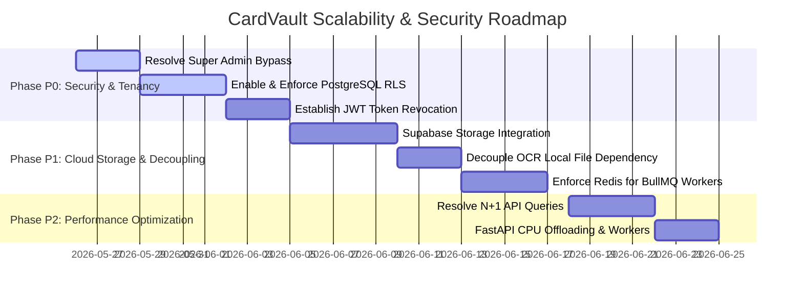
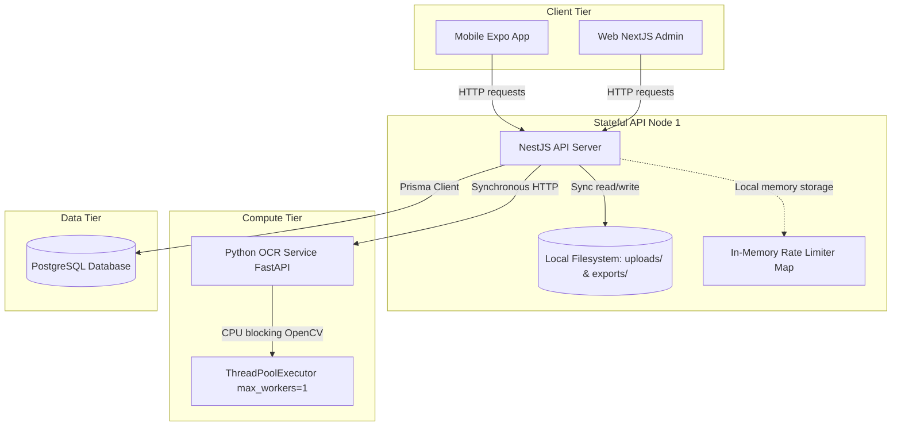
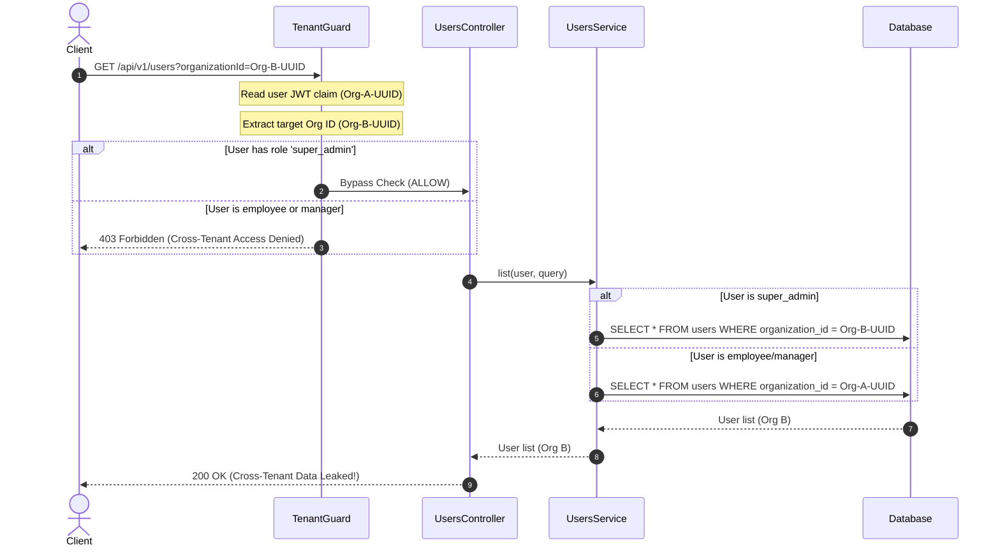
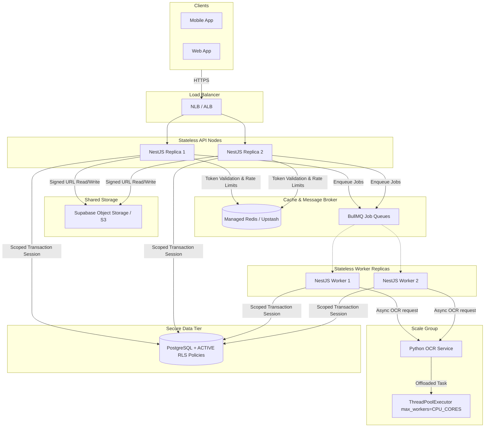

# CardVault Technical Architecture & Scalability Audit

**Prepared by:** Senior SaaS Architect, Staff Backend Engineer & Platform Scalability Auditor  
**Audit Target:** CardVault Codebase (`API/`, `ocr_service/`, `WEB/`, `MOBILE/`)  
**Database Mirror Version:** v3.0 (Prisma Schema + Migrations)

---

## A. SaaS Architecture Verdict

Is this a scalable SaaS architecture?  
**Verdict: NO (PARTIALLY in code design, but NO for production SaaS growth)**

### Rationale
While the codebase is a neatly structured NestJS monolith with logical multi-tenant schema hooks (`organizationId` on all tenant entities), it is currently **unfit for production multi-tenant scale**. It functions as a **single-instance demo / pilot** rather than a true SaaS. 

Three structural categories make it non-scalable:
1. **Stateful Local Disk Coupling:** Both card image uploads ([storage.service.ts](file:///d:/HARSHAL/DEV_PROJECTS/Freelance/CardVault/API/src/storage/storage.service.ts#L98-L102)) and CSV/PDF reports ([export-processor.service.ts](file:///d:/HARSHAL/DEV_PROJECTS/Freelance/CardVault/API/src/modules/exports/export-processor.service.ts#L66)) are saved to local server directories. Replicating the API server horizontally will cause immediate `404 Not Found` errors when load-balanced clients try to access files written on other nodes.
2. **Critical Security Isolation Vulnerability:** The application-layer tenant checks treat **any** user with the role of `super_admin` as a global platform admin. A tenant manager promoted to `super_admin` in their own organization bypasses the [TenantGuard](file:///d:/HARSHAL/DEV_PROJECTS/Freelance/CardVault/API/src/common/guards/tenant.guard.ts#L52) and can view, write, and delete users and organizations across the entire database.
3. **Serialized Compute Blocking:** The backend is tightly coupled with in-process job runners ([setImmediate](file:///d:/HARSHAL/DEV_PROJECTS/Freelance/CardVault/API/src/modules/ocr/ocr-processor.service.ts#L20-L26) fallbacks), and the Python OCR microservice has its processing pool locked to a single thread ([max_workers=1](file:///d:/HARSHAL/DEV_PROJECTS/Freelance/CardVault/ocr_service/app.py#L34)), rendering concurrent OCR operations blocking and serial.

---

## B. Major Strengths

Despite the scalability issues, the codebase includes several well-engineered patterns:
* **Tenant Schema Cohesion:** All tenant-specific models (e.g. `User`, `Contact`, `ContactEncounter`, `EventSession`, `OcrJob`, `CardImage`, `Export`, `SyncQueue`, `Notification`, `RolePermission`) correctly feature an `organizationId` foreign key referencing the `organizations` table.
* **Correlated Traceability:** The [CorrelationIdMiddleware](file:///d:/HARSHAL/DEV_PROJECTS/Freelance/CardVault/API/src/common/middleware/correlation-id.middleware.ts) automatically generates or forwards a `x-correlation-id` header for all requests, which is propagated down to the audit trail and request logs.
* **Robust Image Preprocessing:** The [preprocess.py](file:///d:/HARSHAL/DEV_PROJECTS/Freelance/CardVault/ocr_service/preprocess.py) script leverages OpenCV to resize, sharpen, and denoise business card images before feeding them to PaddleOCR, significantly improving text recognition confidence on noisy mobile captures.
* **Standardized API Response Formatting:** A global NestJS interceptor ([transform.interceptor.ts](file:///d:/HARSHAL/DEV_PROJECTS/Freelance/CardVault/API/src/common/interceptors/transform.interceptor.ts)) wraps success responses in a clean `{ data, meta }` envelope.

---

## C. Critical Weaknesses & Anti-Patterns

### 1. The Global "Super Admin" Loophole (Security Defect)
In [TenantGuard.canActivate](file:///d:/HARSHAL/DEV_PROJECTS/Freelance/CardVault/API/src/common/guards/tenant.guard.ts#L52-L56):
```typescript
if (user.role === 'super_admin' && this.isSuperAdminUserManagementRequest(req)) {
  continue;
}
throw new ForbiddenException('Cross-tenant access denied');
```
And inside [users.service.ts](file:///d:/HARSHAL/DEV_PROJECTS/Freelance/CardVault/API/src/modules/users/users.service.ts#L33):
```typescript
if (user.role === UserRole.super_admin) {
  if (query.organizationId) {
    where.organizationId = query.organizationId;
  }
}
```
* **The Anti-Pattern:** A `super_admin` role is an organization-level property in the database. Because the system does not restrict super-admin powers to a dedicated **System Admin Organization**, any tenant user whose role is changed to `super_admin` within their own tenant is granted unrestricted access to query, edit, and delete users across *all other tenants*.

### 2. Local Storage Lock-in for OCR
In [ocr.service.ts](file:///d:/HARSHAL/DEV_PROJECTS/Freelance/CardVault/API/src/modules/ocr/ocr.service.ts#L88-L92):
```typescript
if (!uploaded.absolutePath) {
  throw new BadRequestException(
    'Server-side OCR requires STORAGE_DRIVER=local or a temp file from storage',
  );
}
```
* **The Anti-Pattern:** The storage abstraction layer is bypassed. If the storage driver is set to `supabase`, `absolutePath` is `undefined`, causing the OCR upload pipeline to throw a `BadRequestException`. The platform **forces** local disk usage (`STORAGE_DRIVER=local`) to execute OCR, locking the API to a single virtual machine.

### 3. Database N+1 Query Storm in OCR Job List
In [ocr.service.ts](file:///d:/HARSHAL/DEV_PROJECTS/Freelance/CardVault/API/src/modules/ocr/ocr.service.ts#L191-L196):
```typescript
const enriched = await Promise.all(
  items.map((job) => this.enrichJob(job)),
);
```
Where `enrichJob` executes:
```typescript
const matches = await this.prisma.relationshipMatch.findMany({ where: { incomingOcrJobId: job.id } });
const contacts = await this.prisma.contact.findMany({ where: { id: { in: contactIds } } });
```
* **The Anti-Pattern:** Fetching a list of 50 OCR jobs initiates **100 additional database queries** in parallel. Under high traffic, this N+1 structure will saturate connection pools and exhaust DB compute resources.

### 4. Memory Leak in In-Memory Rate Limiter Fallback
In [redis.service.ts](file:///d:/HARSHAL/DEV_PROJECTS/Freelance/CardVault/API/src/redis/redis.service.ts#L81-L89):
```typescript
const entry = this.memoryRate.get(key);
if (!entry || now > entry.resetAt) {
  this.memoryRate.set(key, { count: 1, resetAt: now + windowSeconds * 1000 });
  return true;
}
entry.count += 1;
return entry.count <= limit;
```
* **The Anti-Pattern:** When Redis is offline, the in-memory fallback stores rate-limiting counters in a native `Map`. There is no expiration cleanup daemon. Unique keys (e.g., from rotating public IP addresses) will stay in memory indefinitely, causing a slow, steady memory leak that ends in an OOM crash.

### 5. Fixed-Window Rate Limiting Race Condition
In [redis.service.ts](file:///d:/HARSHAL/DEV_PROJECTS/Freelance/CardVault/API/src/redis/redis.service.ts#L75-L78):
```typescript
const count = await redis.incr(bucket);
if (count === 1) {
  await redis.expire(bucket, windowSeconds);
}
```
* **The Anti-Pattern:** The `INCR` and `EXPIRE` commands are not bundled in a transaction or Lua script. If the node crashes or loses connection immediately after the `INCR` but before the `EXPIRE` command is executed, the key will remain in Redis with **no expiration**, permanently blocking the user from making further requests.

### 6. CPU-Blocking Preprocessing on FastAPI Event Loop
In [ocr_service/app.py](file:///d:/HARSHAL/DEV_PROJECTS/Freelance/CardVault/ocr_service/app.py#L145):
```python
image_bgr = preprocess_for_ocr(raw_bytes)
```
* **The Anti-Pattern:** Image resizing and denoising via OpenCV are CPU-heavy synchronous operations. Running them directly in the async route handler blocks the FastAPI main thread, freezing the event loop and preventing other requests (like `/health` checks or queue processing) from resolving.

### 7. Thread pool size = 1 in Python OCR Service
In [ocr_service/app.py](file:///d:/HARSHAL/DEV_PROJECTS/Freelance/CardVault/ocr_service/app.py#L34):
```python
_executor = ThreadPoolExecutor(max_workers=1, thread_name_prefix="paddle-ocr")
```
* **The Anti-Pattern:** The OCR prediction pipeline handles execution through an executor with exactly `max_workers=1`. As a result, OCR requests from all tenants are executed sequentially. If three tenants submit scans concurrently, they must wait in line, leading to response timeouts.

---

## D. Immediate Improvements Required

### 1. Critical (Must fix before staging deployment)
* **Close the Super Admin Loophole:** Update [TenantGuard](file:///d:/HARSHAL/DEV_PROJECTS/Freelance/CardVault/API/src/common/guards/tenant.guard.ts) and [UsersService](file:///d:/HARSHAL/DEV_PROJECTS/Freelance/CardVault/API/src/modules/users/users.service.ts) to verify that a `super_admin` belongs to a hardcoded system administrative organization ID (e.g., `SYSTEM_TENANT_ID`). If they do not, deny cross-tenant operations regardless of their role.
* **Uncouple OCR from Local Storage:** Refactor [StorageService](file:///d:/HARSHAL/DEV_PROJECTS/Freelance/CardVault/API/src/storage/storage.service.ts) to write temporary files to a local temp folder (`/tmp` or a scratch directory) specifically for PaddleOCR extraction when using Supabase Storage, instead of forcing `STORAGE_DRIVER=local`.
* **Fix the Rate Limiter Leak:** Write a simple cleanup job or use a node-cache package with standard TTLs for the in-memory fallback `memoryRate` map to prevent OOM issues.

### 2. Important (Must fix before production release)
* **Atomic Redis Rate Limiting:** Replace the rate limiting logic in [redis.service.ts](file:///d:/HARSHAL/DEV_PROJECTS/Freelance/CardVault/API/src/redis/redis.service.ts#L71-L80) with a Lua script or use a single transaction pipeline (`multi()`) executing `INCR` and `EXPIRE` atomically.
* **Eliminate N+1 Queries:** Refactor [ocr.service.ts](file:///d:/HARSHAL/DEV_PROJECTS/Freelance/CardVault/API/src/modules/ocr/ocr.service.ts#L331) `enrichJob` calls by running bulk database lookups. Fetch all `relationshipMatches` and `contacts` in single queries using `IN` operators and map them in memory:
  ```typescript
  const ocrJobIds = items.map(i => i.id);
  const allMatches = await this.prisma.relationshipMatch.findMany({ where: { incomingOcrJobId: { in: ocrJobIds } } });
  ```
* **Offload CPU Preprocessing:** Wrap the OpenCV call in Python inside the thread executor to avoid blocking the FastAPI event loop:
  ```python
  image_bgr = await loop.run_in_executor(_executor, preprocess_for_ocr, raw_bytes)
  ```

### 3. Nice to Have
* **Full-Text GIN Indexing:** Implement native PostgreSQL GIN indexing with a generated `tsvector` column instead of using the slow `contains` (ILIKE) wildcard match for contacts search.
* **Asymmetric Token Signing:** Transition the JWT implementation from symmetric HS256 to asymmetric RS256 for enhanced security.

---

## E. Future Scale Risks

When this application undergoes traffic growth, it will fail in the following ways:

```
[Tenants Increase]      --->  Tenant data leakage via compromised or malicious Super Admins.
[User Volumes Grow]     --->  In-memory rate limiter falls back and exhausts RAM (OOM Crash).
[Data Volumes Grow]     --->  Database connection pool saturation due to N+1 queries.
[Traffic Spikes]        --->  OCR execution queue fills up due to serialized (max_workers=1) processing.
[Horizontal Replicas]   --->  Uploaded files & reports fail with 404 (stored on local disk of individual nodes).
```

---

## F. Architecture Improvement Roadmap



---

## G. Architecture & Flow Diagrams

### 1. Current Architecture Flow
Notice the single-node bottleneck and the stateful local file dependency.



---

### 2. Tenant Request Lifecycle
This shows how the `super_admin` role bypasses the `TenantGuard` check, opening a pathway to cross-tenant data access.



---

### 3. Database Isolation Architecture
Prisma bypasses the commented-out Row Level Security (RLS) policies by executing queries directly as the database owner.

```mermaid
flowchart TD
    subgraph PostgreSQL Database
        subgraph Table Schemas
            T_Org[Organizations]
            T_Contacts[Contacts]
            T_Users[Users]
        end

        subgraph Security Policies
            RLS_Enabled[RLS Enabled: ALTER TABLE ENABLE RLS]
            RLS_Policies[RLS Policies: CREATE POLICY USING org_id]
            CommentedOut["/!\\ COMMENTED OUT IN MIGRATIONS /!\\"]
        end
    end

    PrismaService[Prisma Client] -->|Connects as database owner postgres| T_Org
    PrismaService -->|Connects as database owner postgres| T_Contacts
    PrismaService -->|Connects as database owner postgres| T_Users

    T_Contacts -.-> RLS_Enabled
    RLS_Enabled -.-> CommentedOut
    CommentedOut -.-> RLS_Policies
    
    Note over PrismaService, T_Contacts: Since Prisma connects as owner/superuser,<br/>it bypasses RLS checks, and because RLS policies<br/>are commented out, there is zero database-level protection.
```

---

### 4. Suggested Scalable SaaS Architecture
A stateless, decoupled target state that supports horizontal scaling and secure multi-tenancy.



---

## H. SaaS Engineering Maturity Score

| Assessment Vector | Score | Detailed Architectural Reasoning |
| :--- | :---: | :--- |
| **Multi-tenancy** | **3 / 10** | Tenant keys are present in tables, but security checks are missing on updates, RLS is disabled/commented out, and there is a major cross-tenant data leak vulnerability in the global Super Admin role logic. |
| **Scalability** | **2 / 10** | Replicating the API server horizontally is blocked by local disk storage dependencies for files and reports. In-process workers (`setImmediate` fallbacks) and a single-threaded Python executor prevent task concurrency. |
| **Maintainability** | **6 / 10** | The code follows standard NestJS design patterns, with well-isolated modules, clear interfaces, DTO schema validation, and mapper separations. |
| **Security** | **2 / 10** | Bypassed TenantGuard checks, commented-out SQL RLS policies, symmetric HS256 JWT signatures, a lack of refresh token rotation (RTR), and path-traversal risks in local file delivery endpoints. |
| **Performance** | **3 / 10** | N+1 queries saturate the database pool during OCR job lists. Image preprocessing runs synchronously on FastAPI's main thread, blocking the event loop. |
| **Modularity** | **6 / 10** | Clear division between the Next.js admin frontend, Expo mobile client, NestJS API, and Python OCR services. |
| **DevOps Readiness** | **1 / 10** | Missing Dockerfiles, Docker-compose files, container deployment settings, and automated CI/CD pipelines. |
| **Enterprise Readiness** | **2 / 10** | Silent truncation of export files at 10,000 records, a lack of SAML/SSO integration, no transaction-safe seat quotas, and an absence of DB-level constraints on audit trails. |

### Overall SaaS Architecture Score: `3.1 / 10`
### Production Readiness Score: `2.0 / 10`
